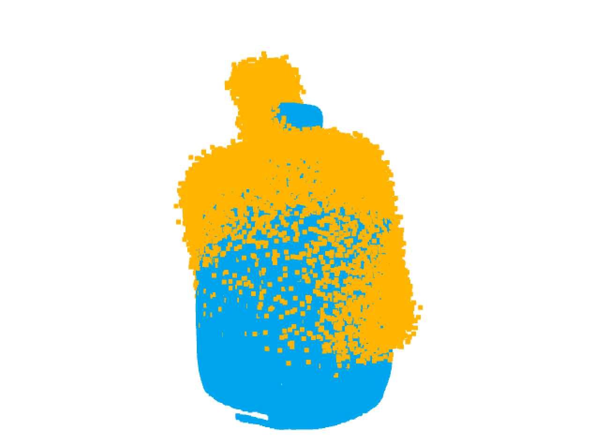
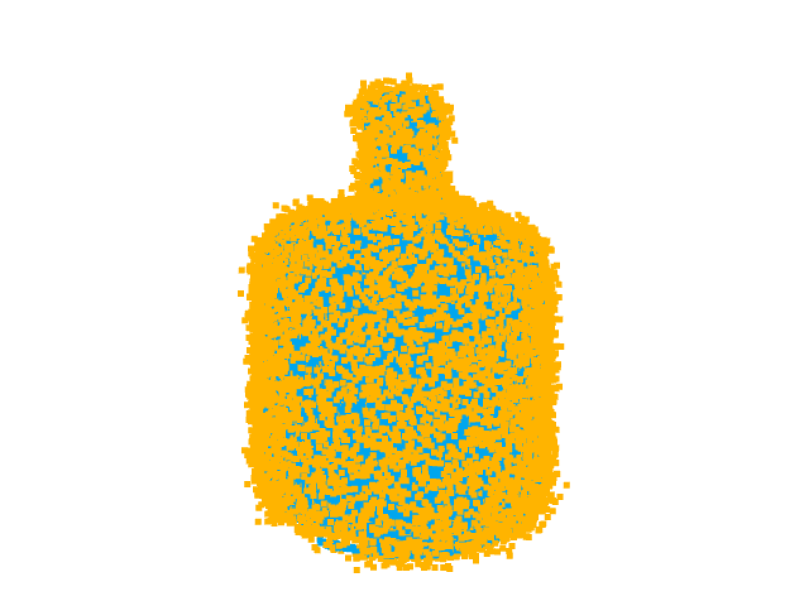
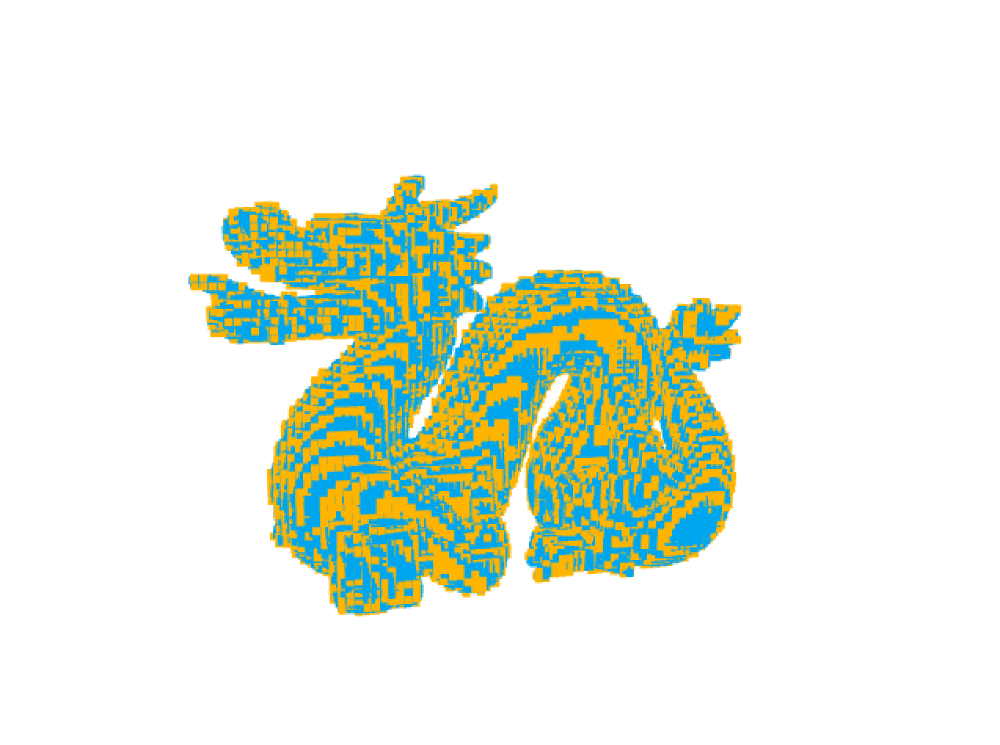

# Cloud registration ICP

The project is about iterative closest point cloud registration: given a source and a target point cloud roughly aligned, find the fine alignment transformation of the source to the target cloud.

  
   

  
   

## Create a build folder and compile throw cmake
- mkdir build && cd build
- cmake ..
- make

## Test the application
./registration path_to_source path_to_target mode

NB: mode can be svd or lm

## Example
- ./registration ../data/bunny/source.ply ../data/bunny/target.ply svd
- ./registration ../data/bunny/source.ply ../data/bunny/target.ply lm

- ./registration ../data/dragon/source.ply ../data/dragon/target.ply svd
- ./registration ../data/dragon/source.ply ../data/dragon/target.ply lm

- ./registration ../data/vase/source.ply ../data/vase/target.ply svd
- ./registration ../data/vase/source.ply ../data/vase/target.ply lm

## RMSE results:
- bunny svd = 0.00401621
- bunny lm = 0.00341366

- dragon svd = 0.00568867
- dragon lm = 0.00564134

- vase svd = 0.0162243
- vase lm = 0.0162218
